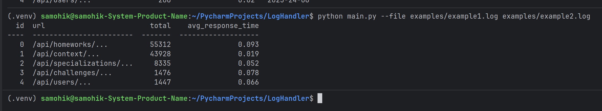
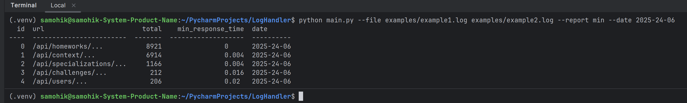
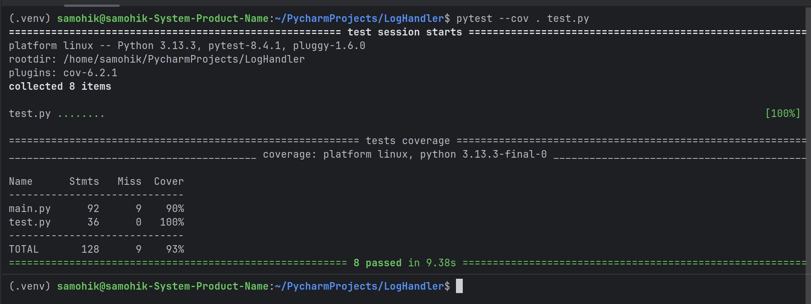

# LogHandler

## Description

### Processes data by displaying average maximum and minimum values as well as sampling by a specific date.

### ```python main.py --file examples_test/example1.log examples_test/example2.log```



### ```python main.py --file examples_test/example1.log examples_test/example2.log --report min --date 2025-24-06```




### ```pytest --cov . test.py```

